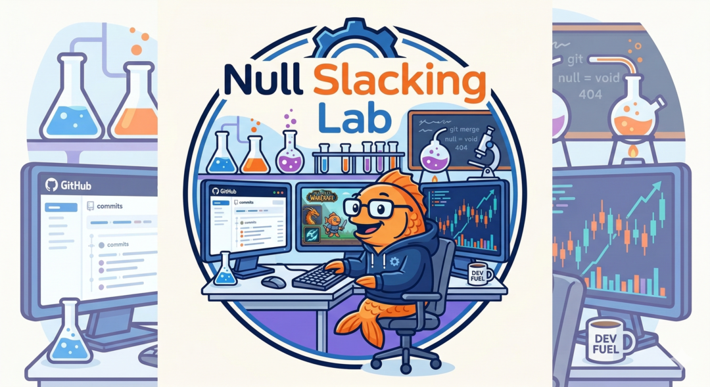

# 🐟 Null Slacking Lab - 摸魚實驗室

> 一個專門研究十年資深工程師如何在上班時間開啟副業的科學實驗室

## 🎯 研究主題

本實驗室致力於記錄一位擁有**十年開發經驗**的軟體設計工程師 Neal 的日常工作型態。經過長期觀察，我們驚奇地發現：資深工程師的「多工處理能力」遠超乎常人想像！

## 🔬 實驗發現

### 發現一：時間管理大師

當公司專案進入**上線倒數**階段時，Neal 展現了驚人的時間切割技術：

- 🌅 早上：參加例會，專業地提出「這個 Token 有什麼意義？」的靈魂拷問
- 🌤️ 中午：深度思考 API Key 的存在價值
- 🌙 下午：投入個人專案開發（畢竟工作與生活要平衡嘛）

### 發現二：開源貢獻狂熱者

在慈濟專案上線的關鍵時刻，Neal 同時維護了三個開源專案：

1. **AfterClose** - 盤後市場掃描 App（誰說上班不能投資理財？）
2. **StarScope** - GitHub 專案情報追蹤（用 GitHub 研究 GitHub，超越元宇宙的概念）
3. **Lunar-UI** - 魔獸世界戰鬥 UI（工作累了要放鬆，合情合理）

### 發現三：資訊安全實踐者

Neal 勇敢地將系統配置檔案推送到 GitHub 公開倉庫，實踐了「透明化開發」的最高境界。什麼是 Secret？不存在的！開源就是要完全開源！

### 發現四：問題導向學習法

例會上展現了十年經驗的深度：

- 「家系圖還沒空解決」（忙著解決個人專案的家系圖？）
- 「Token 應該是不需要」（十年經驗告訴我：懷疑一切）
- 「為什麼需要 ApiKey？」（哲學式發問）
- 「使用者根本不會填 ApiKey」（用戶體驗至上！）

## 📊 研究數據

- **個人專案數量**：3+ (持續增長中)
- **上班時間利用率**：???%
- **例會發言專業度**：⭐⭐⭐⭐⭐
- **摸魚隱蔽性**：🐟🐟🐟🐟🐟

## 🎓 研究結論

經過科學研究證實：十年開發經驗 = 能在同一時間軸上處理 N 個專案的超能力。

誰說工作就不能順便創業？Neal 用實際行動證明了「斜槓工程師」的可行性！

## 📚 相關文獻

詳細研究數據請參閱：[Neal Slacking Evidence](neal-slacking-evidence.md)

---

> ⚠️ **免責聲明**：本研究純屬娛樂性質，如有雷同，純屬巧合。摸魚有風險，上班需謹慎。
