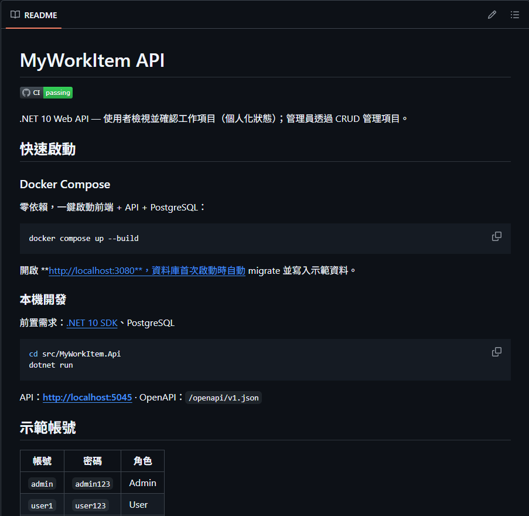
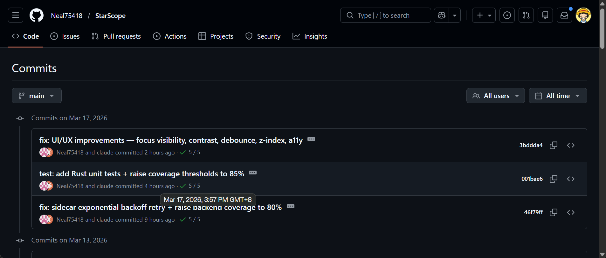
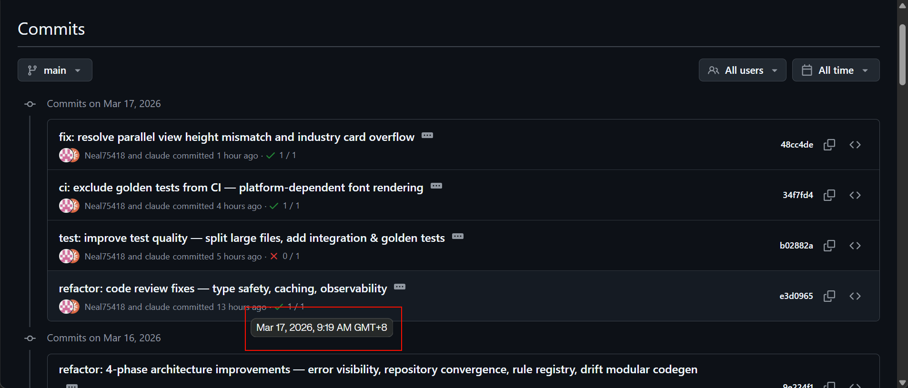
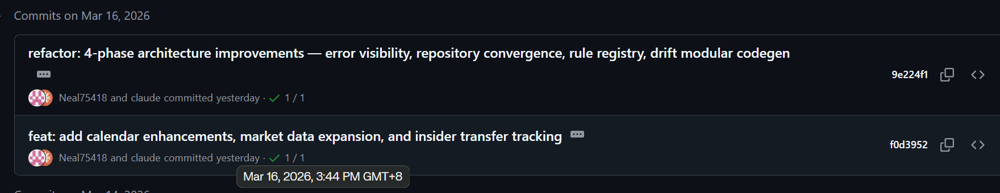
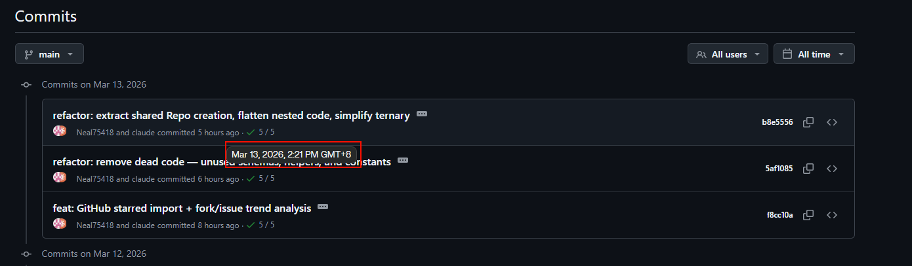
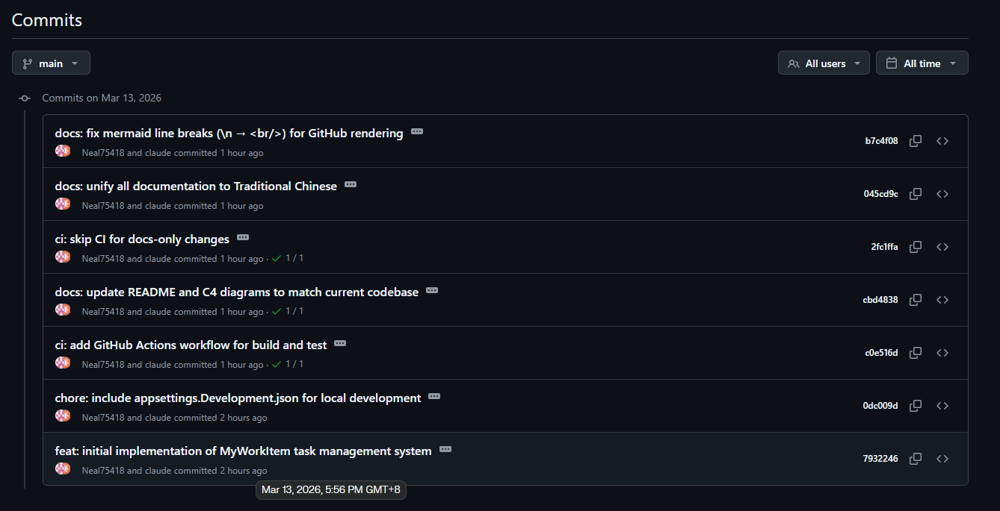
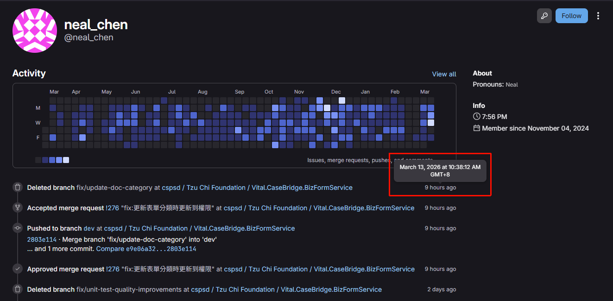
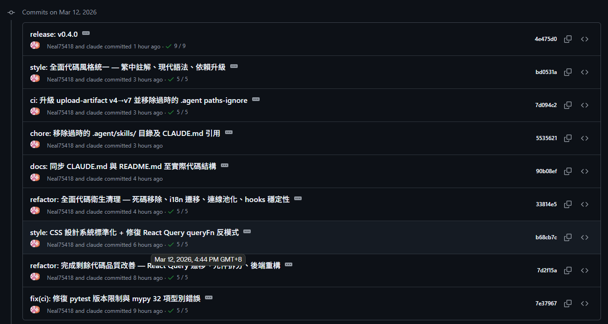
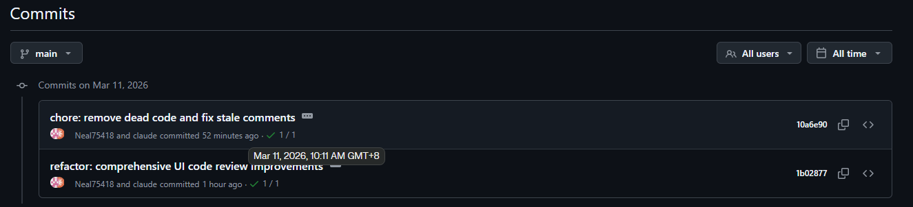
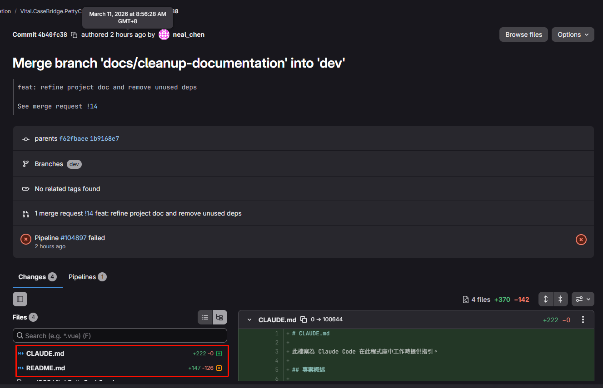

# Neal Slacking Evidence

## 以前系統配置放到外網

項目地址: [GitHub - Neal75418/afterclose: Local-First 盤後市場掃描 App - Scan the entire market after close, see what changed without noise. · GitHub](https://github.com/Neal75418/afterclose)

項目截圖:

項目地址: [GitHub - Neal75418/StarScope: GitHub Project Intelligence for Engineers - Track star velocity, trends, and signals · GitHub](https://github.com/Neal75418/StarScope)

項目截圖:

項目地址: [GitHub - Neal75418/lunar-ui: Phase-driven combat UI system for World of Warcraft inspired by lunar cycles · GitHub](https://github.com/Neal75418/lunar-ui)

項目截圖:

項目地址: [GitHub - Neal75418/MyWorkItem: Task management system built with .NET 10 Clean Architecture + PostgreSQL. Docker Compose one-command startup. · GitHub](https://github.com/Neal75418/MyWorkItem)

項目截圖:

 

## 3/17

早上例會報告: 昨天把臨時補助改成一次性補助，我已經改好，昨天Phill說的問題，可能要請Dennis提供SSH的Key查看問題

可是下午都在做自己專案啊?

## 3/16

早上例會報告: 我都在開會，沒有進展

下午又跑去做自己專案?

## 3/13

早上例會報告: 看今天下午有什麼需要支援修改的地方

一個下午都在做自己的專案?

我們內部跟慈濟討論上線的問題，他卻一點也不關心 Monday 上的問題直到傍晚還能新開專案?

對公司的提交內容卻停留在早上10點而已?

## 3/12

Wilson 表示 Neal 爸爸出狀況今天請假，當前功能已經開發完，功能是使用者停用 BizForm 那邊也要同步停用，但我上去看他的私人倉庫，他都在做自己項目? 所以早上例會沒參加真的是爸爸生病嗎?

## 3/11

早上例會報告: 昨天看停用和啟用使用的API，停用還沒接BizForm的API，啟用就用跟邀請使用者的API，今天開始做

可是大早上又再提交自己專案?

再看看他對我們專案提交的東西，看起來好像很忙，實際看起來不就是裝忙嗎?

## 3/6

今天是慈濟專案上線日，但是他仍有心思做自己的專案?

Neal 早上例會報告: 解決 Production 問題，家系圖還沒空解決，畫面有Token應該是不需要，不確定要不要，我不知道為什麼存在，Neal認為沒有Token存在的意義，可以先改成ApiKey嗎? Neal表示使用者根本不會填 ApiKey ，為什麼需要這個? 最終確認拿掉這個配置，用戶選擇種類填入URL即可

## 3/5

---

## 2/23 上班時間做自己專案

例會報告內容說是 BizForm 的問題所以不確定什麼問題?

## 3/6 daily 10:30 ~ 11:30 ; daily 時仍在做自己的專案

## 3/6 review meeting 仍在做自己的專案

