# Neal Slacking Evidence

## 以前系統配置放到外網

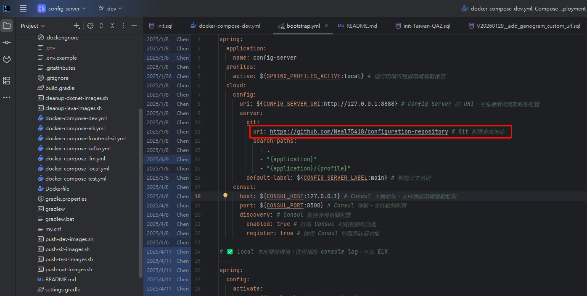

項目地址: [GitHub - Neal75418/afterclose: Local-First 盤後市場掃描 App - Scan the entire market after close, see what changed without noise. · GitHub](https://github.com/Neal75418/afterclose)

項目截圖:

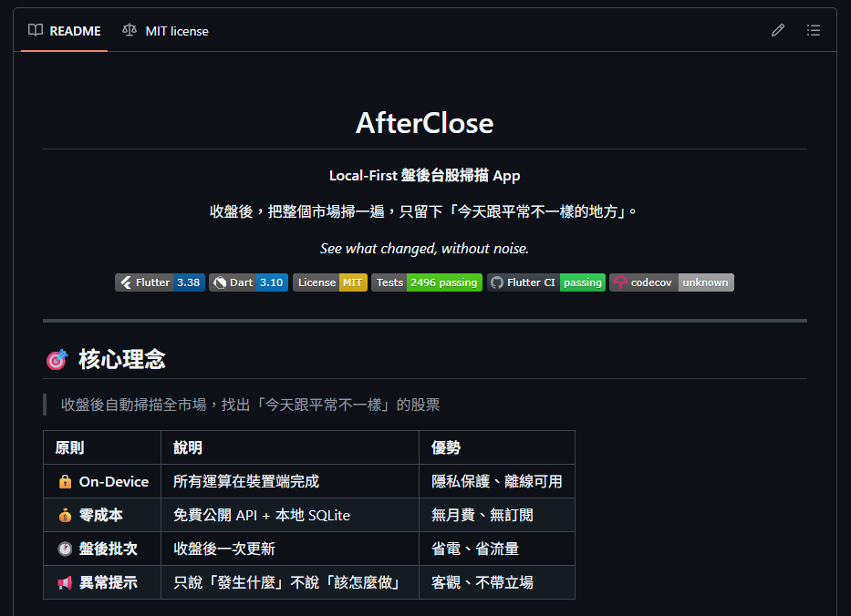

項目地址: [GitHub - Neal75418/StarScope: GitHub Project Intelligence for Engineers - Track star velocity, trends, and signals · GitHub](https://github.com/Neal75418/StarScope)

項目截圖:

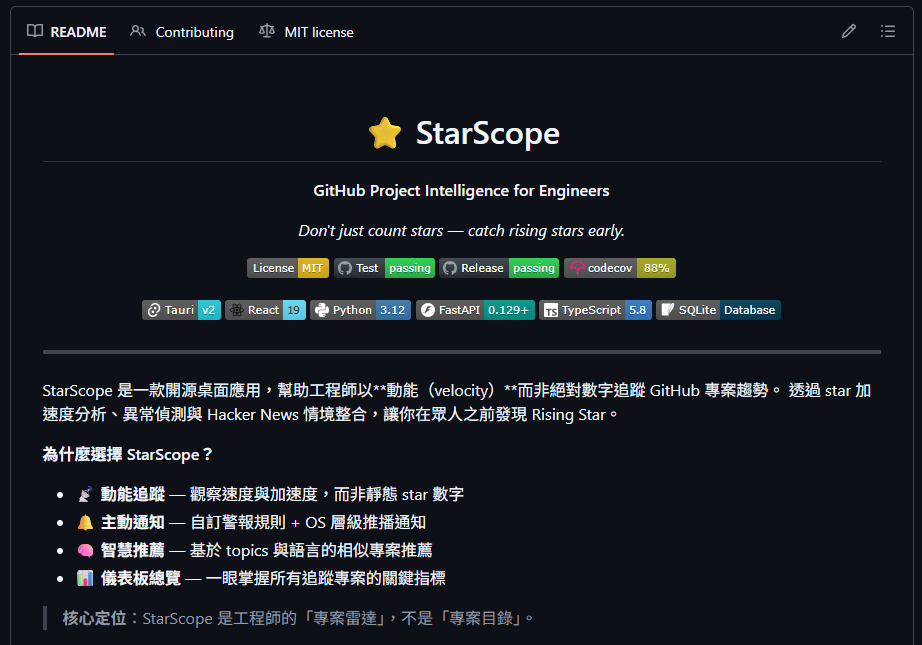

項目地址: [GitHub - Neal75418/lunar-ui: Phase-driven combat UI system for World of Warcraft inspired by lunar cycles · GitHub](https://github.com/Neal75418/lunar-ui)

項目截圖:

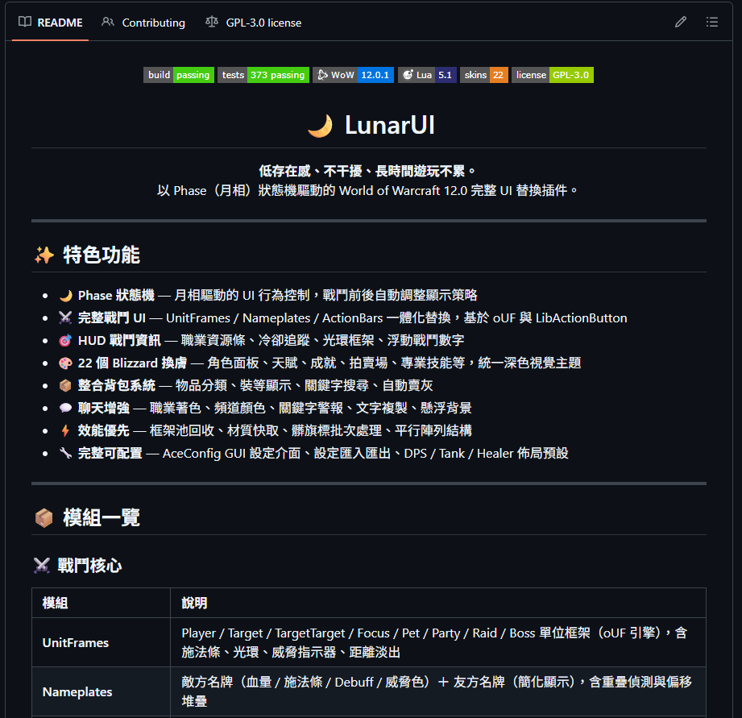

## 3/6

今天是慈濟專案上線日，但是他仍有心思做自己的專案?

Neal 早上例會報告: 解決 Production 問題，家系圖還沒空解決，畫面有Token應該是不需要，不確定要不要，我不知道為什麼存在，Neal認為沒有Token存在的意義，可以先改成ApiKey嗎? Neal表示使用者根本不會填 ApiKey ，為什麼需要這個? 最終確認拿掉這個配置，用戶選擇種類填入URL即可

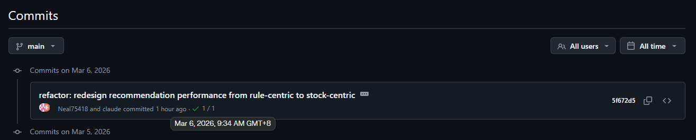

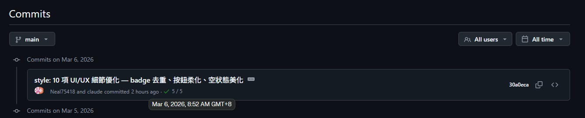

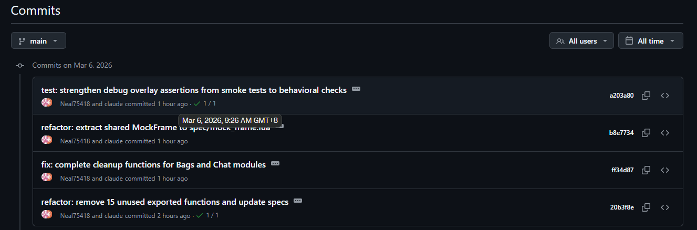

## 3/5

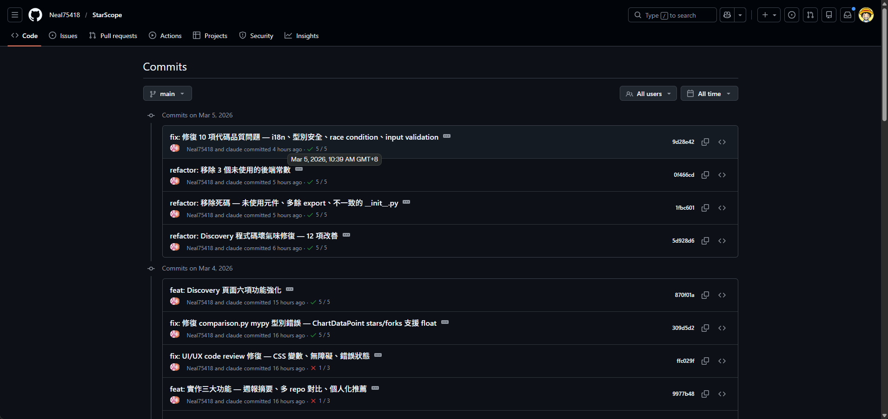

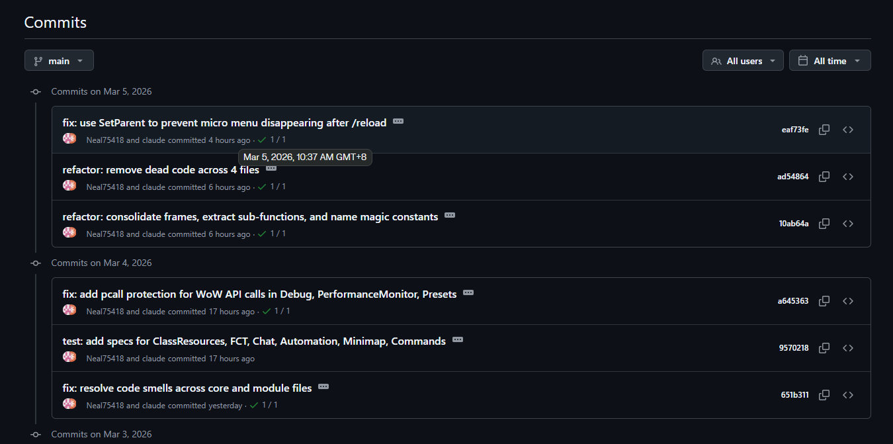

---

## 2/23 上班時間做自己專案

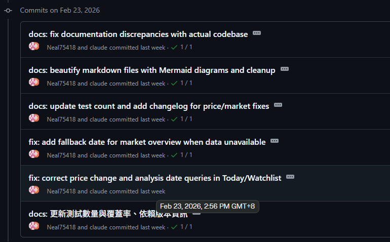

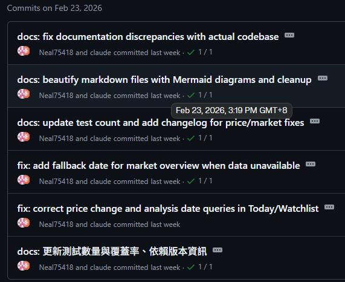

例會報告內容說是 BizForm 的問題所以不確定什麼問題?

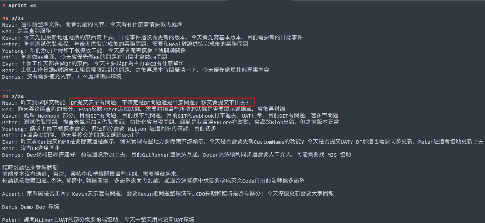

## 3/6 daily 10:30 ~ 11:30 ; daily 時仍在做自己的專案

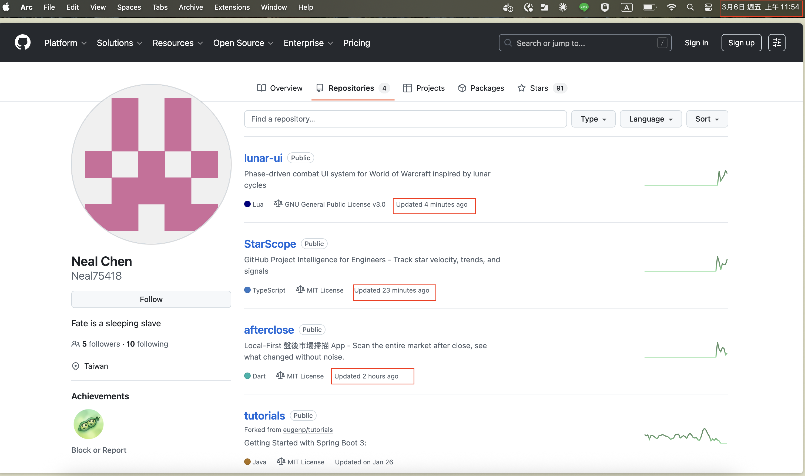

## 3/6 review meeting 仍在做自己的專案

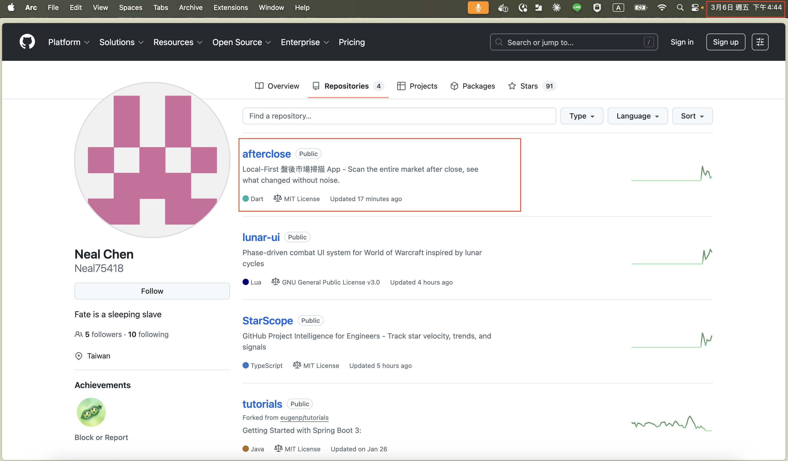
